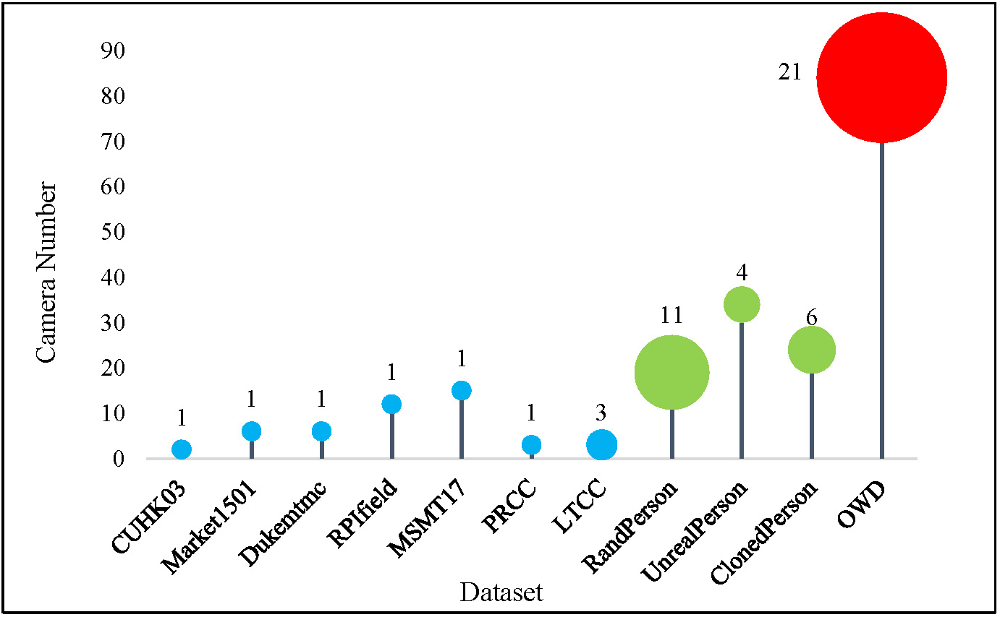
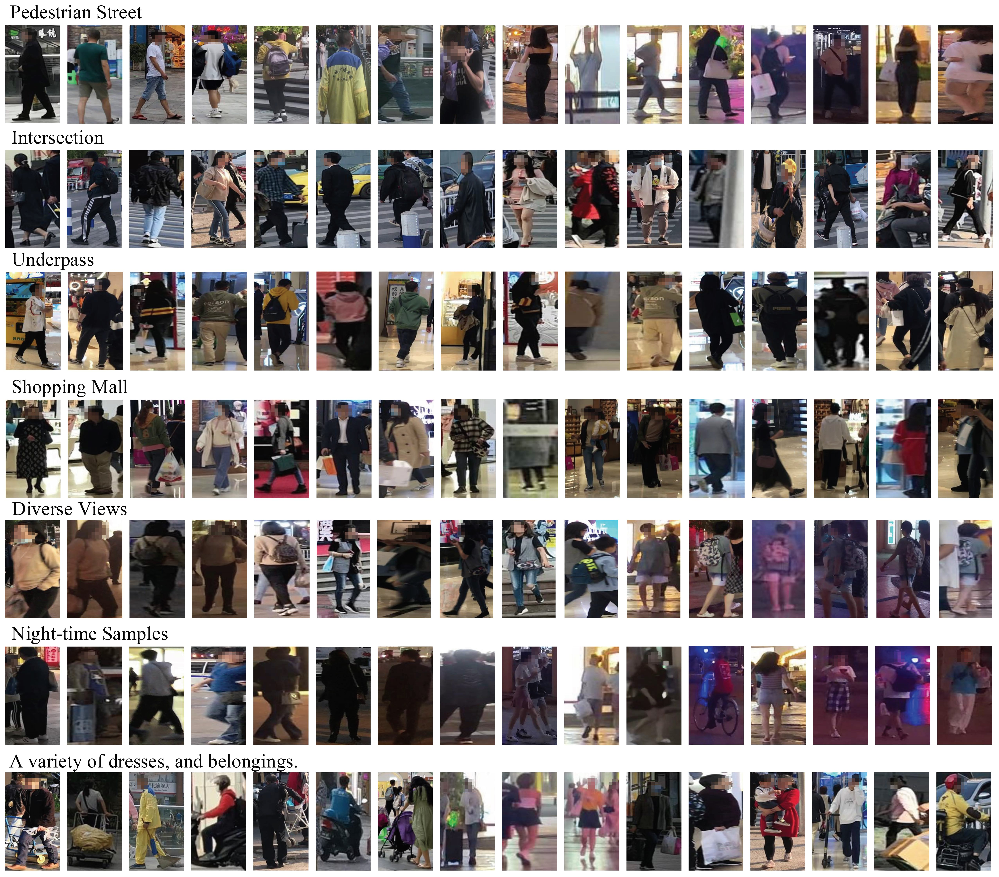
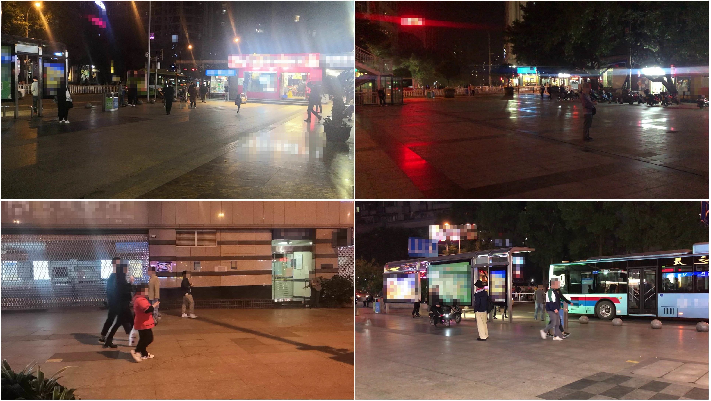

This is the official project page of the paper "An Open-World, Diverse, Cross-Spatial-Temporal Benchmark for Dynamic Wild Person Re-Identification" IJCV 2024. 

Authors: Lei Zhang, Xiaowei Fu, Fuxiang Huang, Yi Yang, Xinbo Gao

We develop a new Open-World, Diverse, Cross-Spatial-Temporal dataset named OWD with several distinct features. 1) Diverse collection scenes: multiple independent open-world and highly dynamic collecting scenes, including streets, intersections, shopping malls, etc. 2) Diverse lighting variations: long time spans from daytime to nighttime with abundant illumination changes. 3) Diverse person status: multiple camera networks in all seasons with normal/adverse weather conditions and diverse pedestrian appearances (e.g., clothes, personal belongings, poses, etc.). 4) Largest scale: It covers the largest number of (84) cameras, (3986) identities, and (136,614) bounding boxes. 

 
 
 

Figure A. Statistics of existing person ReID datasets. The digit above each circle is the number of data collection scenes, the sky-blue circles are real data and the grass-green circles represent synthetic data.
 
 
 
 

Figure B. Examples from OWD with various scenes, camera views, lighting conditions and clothing changes, etc.
 
 
 
 

Figure C. Several collection scenarios of web data, synthetic data and OWD.
 
 
 
 

Figure D. Examples of pictures captured by different cameras under the night collection scene, which show rich visual changes.
 
 
 

# Terms to apply
1) The dataset provided is strictly limited to non-commercial research purposes only.

2) Users are prohibited from reproducing, duplicating, copying, selling, trading, reselling, or exploiting any part of the images or derived data for any commercial use.

3) Users are not authorized to further publish or distribute any part of this dataset.

4) When utilizing images from this dataset for dissemination purposes, such as academic papers, slides, posters, presentations, personal websites, or personal blogs, users must ensure that the faces of any individuals are obscured.

The right to terminate access to this dataset is solely reserved.
 
 
 

# Download

We will release this dataset very soon. 
